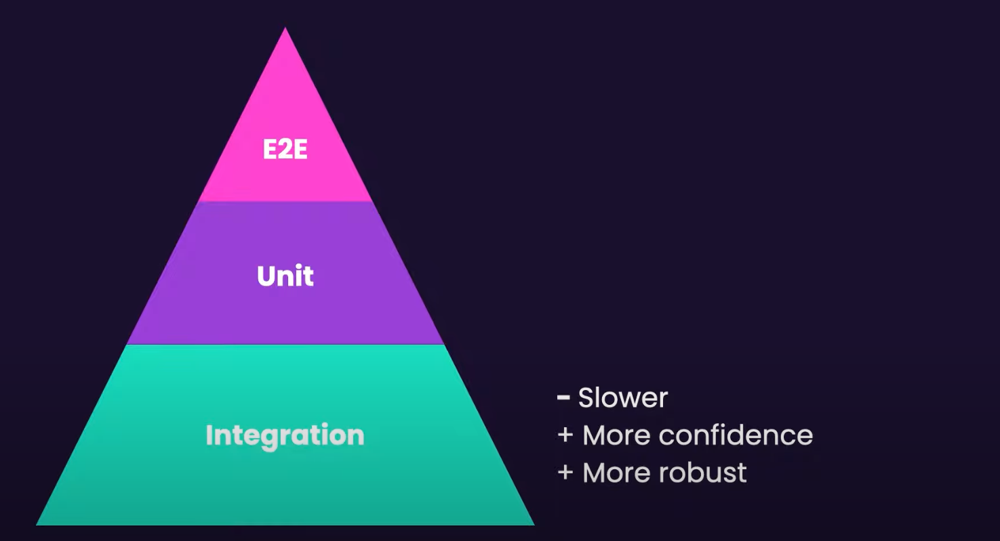

# React + TypeScript + Vite

This template provides a minimal setup to get React working in Vite with HMR and some ESLint rules.

Currently, two official plugins are available:

- [@vitejs/plugin-react](https://github.com/vitejs/vite-plugin-react/blob/main/packages/plugin-react/README.md) uses [Babel](https://babeljs.io/) for Fast Refresh
- [@vitejs/plugin-react-swc](https://github.com/vitejs/vite-plugin-react-swc) uses [SWC](https://swc.rs/) for Fast Refresh

## Expanding the ESLint configuration

If you are developing a production application, we recommend updating the configuration to enable type aware lint rules:

- Configure the top-level `parserOptions` property like this:

```js
export default {
  // other rules...
  parserOptions: {
    ecmaVersion: "latest",
    sourceType: "module",
    project: ["./tsconfig.json", "./tsconfig.node.json"],
    tsconfigRootDir: __dirname,
  },
};
```

- Replace `plugin:@typescript-eslint/recommended` to `plugin:@typescript-eslint/recommended-type-checked` or `plugin:@typescript-eslint/strict-type-checked`
- Optionally add `plugin:@typescript-eslint/stylistic-type-checked`
- Install [eslint-plugin-react](https://github.com/jsx-eslint/eslint-plugin-react) and add `plugin:react/recommended` & `plugin:react/jsx-runtime` to the `extends` list

## Testing

### Frameworks/Libraries

[Testing by Vitest](https://vitest.dev/)

[Testing Library - react-testing-library / typescript](https://testing-library.com/docs/react-testing-library/intro/)

[MSW](https://mswjs.io/docs/getting-started)

### Rules

- [Stick to black-box testing: Test only public methods](https://github.com/goldbergyoni/javascript-testing-best-practices?tab=readme-ov-file#-50-best-practices-super-comprehensive-and-exhaustive)
- [Structure tests by the AAA pattern](https://github.com/goldbergyoni/javascript-testing-best-practices?tab=readme-ov-file#-%EF%B8%8F-12-structure-tests-by-the-aaa-pattern)

### What to test

- How they render
  - **What it does**, not how it is implemented
- How they respond to user action

  
  From: [React Testing for Beginners: Start Here!](https://www.youtube.com/watch?v=8Xwq35cPwYg&t=1934s)

### What NOT to test

- Styles
  - because it is fragile and testing with codes won't assure the quality

### How to Test each granularity of Atomic Design Pattern

[(Atomic Design with TDD/BDD (testing strategies) — Part 1)](https://medium.com/@arshdeepsinghmakker/atoms-molecules-tdd-eda4dc3f7238)
[(Atomic Design with TDD/BDD (testing strategies) — Part 2)](https://medium.com/@arshdeepsinghmakker/atoms-molecules-sections-tdd-ee7b47a56c2c)

#### - Atoms

**Use [Snapshort tests](https://jestjs.io/docs/snapshot-testing)**
It is basically unit tests and conducted with TDD

1. Props are dynamic, so you will not be testing only the static HTML tags
2. It is just testing the rendering, anyways the components like a button does not have a lot of functionality
3. It is one of the most fundamental blocks of your app, and hence it would most likely not be changed most often
4. If someone does change he/she should know this was meant to be like this.

#### - Molecules

**Use [Snapshort tests](https://jestjs.io/docs/snapshot-testing)**
It is basically unit tests and conducted with TDD
(Considering this in the same category of Atoms)

#### - Organisms

**Use an approach of behavioural testing**

#### - Templates

**Use an approach of behavioural testing**

#### - Pages

**Use an approach of behavioural testing**

### articles/references

[Qiita - フロントエンドテストにおける知見の宝庫を発見！「javascript-testing-best-practices」(Japanese tech-related articles base)](https://qiita.com/taisei-13046/items/662a289dc7328fb64836)

[javascript-testing-best-practices](https://github.com/goldbergyoni/javascript-testing-best-practices)

## Component Architecture - Atomic Design

- Atoms: just blocks of a UI
- Molecules: Combination of Atoms
- Organisms: Combination of molecules and atoms. sometimes with logics
- Templates: Wrapper of components(atoms/molecules/organisms) without containing specific contents. sometimes with logics
- Pages: Specific instance where templates are populated with real contents and it is functional

[(referenced from this page)](https://www.linkedin.com/pulse/atomic-design-react-components-kartik-budhraja/)

## Styling

[Styling with Tailwind CSS](https://tailwindcss.com/docs/guides/vite)

## Todo

- [x] setup react / ts
- [x] setup vitest
- [x] setup vite
- [x] install and setup react-router
- [x] set up tailwind
- [ ] [implement the speech reognition function](https://qiita.com/hmmrjn/items/4b77a86030ed0071f548)
- [ ] Implement the search function for the input by voice
- [ ] diary function

## What I did through this project

- Practiced testing with code-along with [React Testing for Beginners: Start Here!
  ](https://www.youtube.com/watch?v=8Xwq35cPwYg&t=1934s)
